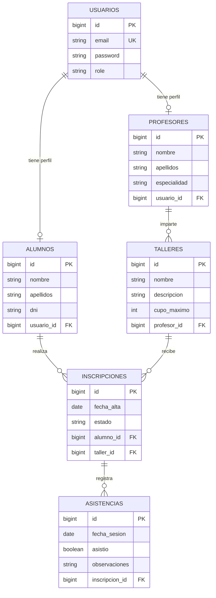

### Base de Datos

---

La capa de persistencia de **Artia – Aula Creativa** ha sido diseñada bajo el principio de **abstracción de almacenamiento**. Gracias al uso de **Spring Data JPA** y el estándar **ORM** (Hibernate), la lógica de negocio permanece agnóstica respecto al motor de base de datos subyacente, permitiendo cambiar de tecnología según el entorno de ejecución sin impactar en el código fuente.

---

#### 1. Estrategia de Desarrollo: H2 Database

Para las fases de desarrollo local, prototipado y pruebas automatizadas (CI), se utiliza **H2**, un motor de base de datos relacional escrito en Java que destaca por su ligereza y velocidad.

##### Justificación de la elección

* **Ciclo de Feedback Rápido:** Al ejecutarse en modo *In-Memory*, el tiempo de arranque y las transacciones son casi instantáneas.
* **Aislamiento:** Cada ejecución comienza con un estado limpio, garantizando que las pruebas de integración sean deterministas y no dependan de residuos de ejecuciones anteriores.
* **Cero Configuración:** Al ser una base de datos embebida, no requiere la instalación de servicios externos (Docker o Daemons) en la máquina del desarrollador.

##### Configuración del Entorno (Profile: `dev`)

La configuración se define para maximizar la visibilidad y el control durante la programación.

```properties
# --- H2 Configuration (application-dev.properties) ---
spring.datasource.url=jdbc:h2:mem:artia_db;DB_CLOSE_DELAY=-1
spring.datasource.driverClassName=org.h2.Driver
spring.datasource.username=sa
spring.datasource.password=

# --- JPA & Hibernate ---
# Desactivamos la generación automática para validar nuestros scripts SQL
spring.jpa.hibernate.ddl-auto=none
spring.jpa.database-platform=org.hibernate.dialect.H2Dialect

# Logging detallado para depuración de queries
spring.jpa.show-sql=true
spring.jpa.properties.hibernate.format_sql=true

```

##### Inicialización de Esquema (Schema-First)

En lugar de permitir que Hibernate genere las tablas automáticamente (lo cual puede ocultar errores de diseño), se ha optado por un enfoque **Schema-First**. Spring Boot carga automáticamente los siguientes scripts al inicio:

1. **`schema.sql`**: Contiene los `CREATE TABLE` y restricciones (PK, FK). Simula el comportamiento de herramientas de migración profesional como Flyway.
2. **`data.sql`**: Pobla la base de datos con un conjunto de datos "semilla" (usuarios de prueba, talleres base) para facilitar las pruebas manuales.

---

#### 2. Modelo de Datos (Diagrama E-R)

El siguiente diagrama representa la estructura relacional implementada en la base de datos, reflejando las entidades del dominio y sus cardinalidades.



---

#### 3. Estrategia de Producción: MySQL

Para el entorno de producción, la arquitectura está preparada para conmutar a **MySQL**. Esta decisión se basa en la necesidad de persistencia duradera, concurrencia robusta y soporte avanzado de tipos de datos.

La transición se gestiona mediante **Perfiles de Spring**. Al activar el perfil `prod`, la aplicación ignora la configuración de H2 y carga la conexión al clúster de base de datos real.

##### Configuración de Producción (Profile: `prod`)

```properties
# --- MySQL Configuration (application-prod.properties) ---
spring.datasource.url=jdbc:mysql://db:3306/artia_db
spring.datasource.username=root
spring.datasource.password=root

# Dialecto optimizado para MySQL
spring.jpa.database-platform=org.hibernate.dialect.MySQLDialect

# En producción, nunca se recrea el esquema automáticamente
spring.jpa.hibernate.ddl-auto=validate

```

Esta separación garantiza que el entorno de desarrollo sea ágil (H2) mientras que el entorno productivo sea robusto y escalable (MySQL), cumpliendo con los estándares actuales de la industria.

---

#### 5. Aislamiento y Contenerización de la Infraestructura

Para garantizar un despliegue seguro, reproducible y mantenible, la base de datos de producción no se ejecutará en el mismo entorno que la aplicación ni compartirá recursos directamente con ella. En su lugar, el sistema de persistencia estará completamente aislado dentro de su propio contenedor Docker.

La orquestación de esta infraestructura se gestionará íntegramente a través de **Docker Compose**. Mediante la definición de los servicios en un archivo `docker-compose.yml`, la inicialización del entorno se realizará de forma automatizada mediante el comando `docker compose up`.

Este enfoque proporciona ventajas críticas para el entorno de producción:

* **Aislamiento de red:** El contenedor de MySQL y el contenedor de la aplicación (backend) se desplegarán dentro de una red privada virtual creada por Docker. Esto permite que la aplicación resuelva la conexión a través del nombre del servicio (host `db`), mientras que la base de datos permanece oculta y protegida de accesos externos no autorizados.
* **Desacoplamiento:** La separación en contenedores distintos asegura que los ciclos de vida de la aplicación y la base de datos sean independientes, facilitando actualizaciones, respaldos y el escalado horizontal del backend sin afectar la integridad del almacenamiento.

---

[Volver](/README.md)