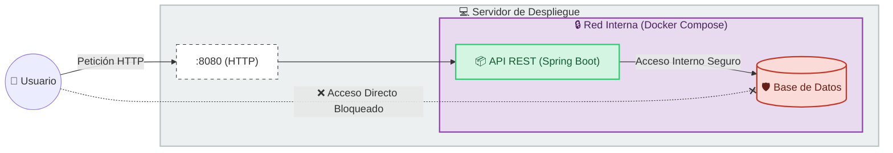

### Despliegue

---

Este apartado detalla la arquitectura de sistemas y el flujo de despliegue diseñado para garantizar la portabilidad, escalabilidad y consistencia de la aplicación en los diferentes entornos (Desarrollo, Test y Producción).

#### Arquitectura de Ejecución (Runtime)

La aplicación se ha construido sobre el ecosistema **Spring Boot**, lo que permite generar un artefacto autocontenido (Fat JAR).

* **Servidor Embebido:** La aplicación no requiere el despliegue en un servidor de aplicaciones externo (como JBoss o WildFly), ya que incluye un servidor **Tomcat embebido**.
* **Independencia:** Este enfoque permite ejecutar el servicio simplemente disponiendo de una JVM (Java Virtual Machine), facilitando su integración en arquitecturas de microservicios o despliegues en la nube.

---

#### Estrategia de Contenedorización (Docker)

Para eliminar el problema de "funciona en mi máquina" y garantizar la paridad entre entornos, se utiliza **Docker** como estándar de empaquetado y distribución.

* **Imagen Base Optimizada:** Las imágenes de producción se construyen sobre **Alpine Linux**. Esta distribución minimalista reduce drásticamente el tamaño final de la imagen y la superficie de ataque (seguridad), ofreciendo un entorno ligero, estable y de alto rendimiento.
* **Aislamiento:** La aplicación y todas sus dependencias (JDK, librerías del sistema) residen dentro del contenedor, desacoplando el software del sistema operativo del host.

##### Entorno de Desarrollo Estandarizado (DevContainers)

Para la fase de codificación, se ha implementado la especificación de **DevContainers**. Esto permite que todo el equipo de desarrollo comparta una configuración idéntica (mismas versiones de Java, Maven y extensiones del IDE) definida como código, acelerando el *onboarding* de nuevos desarrolladores.

---

#### Orquestación y Red (Docker Compose)

La gestión del ciclo de vida de la aplicación y su infraestructura de datos se realiza mediante **Docker Compose**, permitiendo definir la arquitectura en un único archivo declarativo (`docker-compose.yml`) con una política de red estricta:

* **Aislamiento de Red (Bridge Network):** Se ha configurado una red interna privada donde conviven la API y la Base de Datos. Los contenedores se comunican entre sí utilizando nombres de servicio DNS internos.
* **Política de Puertos (Security by Design):**
* **API REST:** Expone únicamente el puerto **8080** al sistema anfitrión para recibir peticiones HTTP.
* **Base de Datos:** Se despliega en modo "Caja Negra". **No expone ningún puerto al exterior**. La base de datos es invisible desde internet y solo acepta conexiones provenientes del contenedor de la aplicación.

---

#### Estrategia de Persistencia y Datos

La arquitectura de datos se ha diseñado siguiendo el patrón de **Abstracción de Persistencia**, desacoplando la lógica de negocio del motor de base de datos.

##### Motor de Desarrollo: H2 Database

En la fase actual se utiliza **H2**, una base de datos ligera en memoria o archivo local.

* **Justificación:** Su nula necesidad de instalación permite iteraciones rápidas y facilita la ejecución de tests de integración sin infraestructura compleja.

##### Escalabilidad a Producción (JPA + Hibernate)

Gracias al uso de **JPA** y **Hibernate**, la migración a un motor de producción robusto (como **PostgreSQL** o **MySQL**) es transparente. No requiere refactorización de código, limitándose únicamente a un cambio de configuración en el archivo `application.properties` y la inclusión del driver correspondiente.

---

#### Diagrama de Arquitectura de Despliegue

El siguiente esquema ilustra la topología de red, destacando el aislamiento de la capa de datos:

---

[Volver](/README.md)