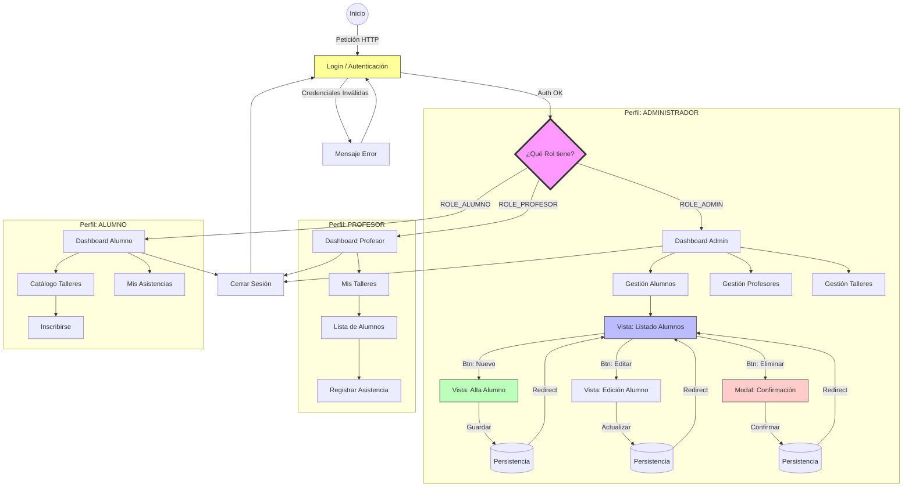

### Diagrama de Navegación y Flujo de Pantallas

---

El siguiente diagrama ilustra la arquitectura de navegación de la aplicación, destacando la segregación de rutas basada en roles y el flujo de pantallas para las operaciones CRUD.

## Mapa de Navegación por Roles
El sistema implementa un control de acceso estricto. La navegación se bifurca inmediatamente después del Login dependiendo de los privilegios del usuario (`ROLE_ADMIN`, `ROLE_PROFESOR`, `ROLE_ALUMNO`).

---

[Volver](/README.md)