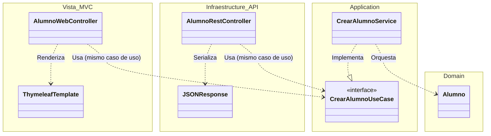

### Organización de Paquetes, Interfaces y Clases

---

La estructura del código fuente se ha diseñado para reflejar los principios de la **Clean Architecture**, asegurando una clara separación de responsabilidades y la reutilización de la lógica de negocio en diferentes interfaces (API REST y Web HTML).

El proyecto se organiza en tres grandes módulos lógicos bajo el paquete raíz: `aulaCreativa` (Núcleo), `vista` (Interfaz Web) y `common` (Utilidades).

---

#### 1. Estructura Global de Paquetes

A continuación se detalla la jerarquía de directorios implementada:

```text
es.etg.daw.dawes.java.rest
├── common                      # Módulo Transversal
│   ├── domain
│   │   ├── model               # Value Objects genéricos (Identificador.java)
│   │   └── repository          # Interfaces base (CRUDRepository.java)
│   └── infraestructure         # Manejo global de excepciones
│
├── aulaCreativa                # Módulo Principal (Bounded Context)
│   ├── application             # CAPA DE APLICACIÓN (Orquestación)
│   │   ├── command             # DTOs de entrada (Input Data)
│   │   ├── service             # Implementación de la lógica de aplicación
│   │   └── useCase             # Interfaces de los Casos de Uso (Input Ports)
│   │
│   ├── domain                  # CAPA DE DOMINIO (Reglas de Negocio)
│   │   ├── error               # Excepciones específicas del dominio
│   │   ├── model               # Entidades Puras (Alumno, Taller...)
│   │   └── repository          # Interfaces de acceso a datos (Output Ports)
│   │
│   └── infraestructure         # CAPA DE INFRAESTRUCTURA (Frameworks)
│       ├── config              # Configuración Spring (Beans, Security)
│       ├── db                  # Persistencia (JPA Entities, Repos)
│       ├── mapper              # Conversores (Model <-> Entity <-> DTO)
│       └── web                 # API REST Controllers (Devuelven JSON)
│
└── vista                       # Módulo de Presentación (Web MVC)
    └── infraestructure         # Adaptador Web UI
        ├── controller          # Controladores Thymeleaf (Devuelven HTML)
        └── model               # ViewModels para las plantillas

```

---

#### 2. Definición de Capas y Componentes

La arquitectura permite que múltiples "canales" (REST y Web) convivan utilizando el mismo núcleo. A continuación, se describe la responsabilidad de cada paquete:

##### 2.1. Módulo Common

Contiene elementos transversales y agnósticos al negocio.

* **`common.domain.repository.CRUDRepository`:** Contrato base para operaciones de persistencia, evitando repetir código en cada repositorio específico.

##### 2.2. Capa Domain (`aulaCreativa.domain`)

Es el corazón estable del sistema. No conoce ni a la base de datos ni a Thymeleaf.

* **`model`:** Entidades ricas (`Alumno`, `Profesor`).
* **`repository`:** Interfaces que definen cómo se guardan los datos (`AlumnoRepository`).

##### 2.3. Capa Application (`aulaCreativa.application`)

Orquesta los casos de uso. Es el punto de entrada único para cualquier interfaz.

* **`useCase` (Interfaces):** Define las operaciones del sistema (ej: `CrearAlumnoUseCase`).
* **`service` (Implementación):** Contiene la lógica que coordina el dominio. Es reutilizada tanto por la API REST como por la Vista Thymeleaf.

##### 2.4. Capa Infraestructure (`aulaCreativa.infraestructure`)

Detalles técnicos y adaptadores de la API.

* **`web` (API REST):** Controladores (`RestController`) que reciben JSON y responden JSON. Ideal para clientes móviles o SPAs.
* **`db`:** Implementación JPA de los repositorios del dominio.

##### 2.5. Capa Vista (`vista.infraestructure`)

Adaptador para la interfaz de usuario basada en servidor (SSR).

* **`controller` (MVC):** Controladores de Spring MVC (`@Controller`). A diferencia de la API, estos controladores:
1. Reciben peticiones de formularios HTML.
2. Llaman a los mismos `UseCases` que la API.
3. Inyectan los datos en el `Model` de Spring.
4. Devuelven el nombre de la plantilla **Thymeleaf** a renderizar (ej: `"alumnos/lista"`).


---

#### 3. Diagrama de Arquitectura y Reutilización

El siguiente diagrama es clave: demuestra cómo **dos adaptadores diferentes (Web Controller y Rest Controller) consumen la misma lógica de aplicación**, cumpliendo el principio de arquitectura hexagonal.



---

#### 4. Justificación del Diseño

Esta estructura híbrida (API + Vista) valida la robustez de la arquitectura:

1. **Reutilización del 100%:** La lógica de validación, creación y negocio (`CrearAlumnoService`) se escribió una sola vez y sirve tanto para la App Móvil (vía REST) como para la Web de Administración (vía Thymeleaf).
2. **Multicanalidad:** El sistema está preparado para añadir nuevos adaptadores (ej. un bot de Telegram o una CLI) sin tocar el dominio.
3. **Separación de Conceptos:** La capa `vista` solo se preocupa de *cómo mostrar* los datos (HTML/CSS), mientras que `aulaCreativa` se preocupa de *qué son* los datos.

---

[Volver](/README.md)