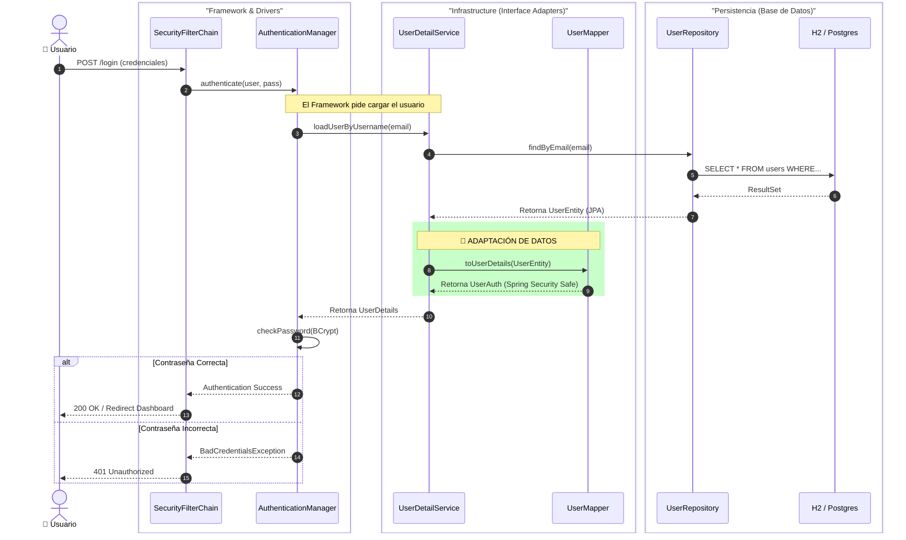

### Seguridad Integral del Sistema

---

#### Diseño de Seguridad y Arquitectura de Autenticación

Siguiendo las directrices del proyecto, la seguridad se implementa utilizando **Spring Security** como capa de protección transversal, integrada dentro de la **Arquitectura Clean** mediante el patrón de *Vertical Slicing*.

##### 1. Integración en Arquitectura Clean
La seguridad se trata como una responsabilidad de la capa de **Infraestructura** y **Adaptadores**. El Dominio permanece agnóstico a Spring Security, comunicándose únicamente a través de interfaces y modelos propios.

* **Vertical Slice:** Se ha definido un slice específico `auth` (`com.aulacreativa.auth`) que encapsula toda la lógica de identidad.
* **Separación de Responsabilidades:**
    * **Dominio (`auth.domain`):** Define qué es un `Usuario`, sus `Roles` y `Permisos` (Reglas de Negocio).
    * **Aplicación (`auth.application`):** Puertos de entrada y salida (Interfaces) para la gestión de usuarios.
    * **Infraestructura (`auth.infrastructure`):** Implementación de `UserDetails`, Repositorios JPA, y la configuración del `SecurityFilterChain`.

##### 2. Modelo de Dominio de Seguridad
Siguiendo la especificación de requisitos, se ha diseñado un sistema de permisos granulares agrupados en roles (RBAC).

* **Entidades y Value Objects**
    * **Usuario:** Agregado principal que contiene la identidad (ID, email, password hasheada) y su Rol.
    * **UsuarioId:** Value Object para identificar unívocamente al usuario.

* **Estrategia de Roles y Permisos**
    Para permitir una gestión flexible, se utilizan Enums que mapean Roles a conjuntos de Permisos específicos (*Authorities*):
    1.  **Enum `Permiso`:** Define las acciones atómicas (ej. `WORKSHOP_READ`, `STUDENT_CREATE`).
    2.  **Enum `Rol`:** Agrupa permisos.
        * `ALUMNO`: Permisos de lectura de talleres y gestión de su propio perfil.
        * `PROFESOR`: Gestión de asistencias y visualización de sus alumnos asignados.
        * `ADMIN`: Control total del sistema (Gestión de usuarios, creación de talleres, etc.).

##### 3. Flujo de Autenticación (Spring Security Flow)
El proceso de login sigue el flujo estándar adaptado a nuestra persistencia JPA:

1.  **Interceptación:** El `SecurityFilterChain` captura la petición de login.
2.  **UserDetailsService (Infraestructura):** El sistema consulta el repositorio (`UserEntityRepository`).
3.  **Mapping (Clean Arch):** Un componente **Mapper** (`UserMapper`) convierte la entidad de base de datos (`UserEntity`) en un objeto que Spring entiende (`UserAuth`), inyectando las autoridades correspondientes al Rol del usuario.
4.  **Validación:** El `AuthenticationManager` verifica el hash de la contraseña usando **BCrypt**.
5.  **Contexto:** Si es válido, se establece el `SecurityContext` para la sesión.

##### 4. Configuración de Seguridad (SecurityFilterChain)
La configuración aplica reglas de autorización a nivel de petición HTTP (`authorizeHttpRequests`):

* **Rutas Públicas:** `/login`, `/css/**`, `/js/**`, `/images/**`.
* **Protección por Rol:**
    * `/admin/**` → Requiere estrictamente `ROLE_ADMIN`.
    * `/profesores/**` → Accesible para `ROLE_ADMIN` y `ROLE_PROFESOR`.
    * `/talleres/**` → Lectura permitida para `ROLE_ALUMNO`, escritura restringida.
* **Defensa:** Se habilita la protección **CSRF** (Cross-Site Request Forgery) para asegurar los formularios.

---

#### Seguridad de Infraestructura y Red (Network Hardening)

Siguiendo el principio de **Defensa en Profundidad**, la seguridad de la aplicación no se limita a la autenticación de usuarios, sino que se extiende a la infraestructura de despliegue.

##### 1. Reducción de la Superficie de Ataque
La arquitectura desplegada mediante Docker Compose implementa una política de **mínimo privilegio a nivel de red**:
* **Ocultación de Activos Críticos:** La base de datos reside en una subred privada y no tiene mapeo de puertos hacia el exterior. Esto hace técnicamente imposible realizar ataques directos (como Inyección SQL por fuerza bruta) desde fuera del entorno de contenedores.
* **Bastión Único:** El único punto de entrada al sistema es el puerto `8080` (API Spring Boot). Todo tráfico debe pasar obligatoriamente por los filtros de seguridad de la aplicación.

##### 2. Inmutabilidad del Entorno
El uso de contenedores efímeros basados en imágenes de **Alpine Linux** garantiza un entorno seguro por defecto:
* **Dependencias Controladas:** Se minimizan las vulnerabilidades al no incluir paquetes de sistema innecesarios.
* **Reversibilidad:** En caso de incidente, el contenedor puede ser destruido y recreado desde una imagen limpia en segundos.

---

[Volver](/README.md)